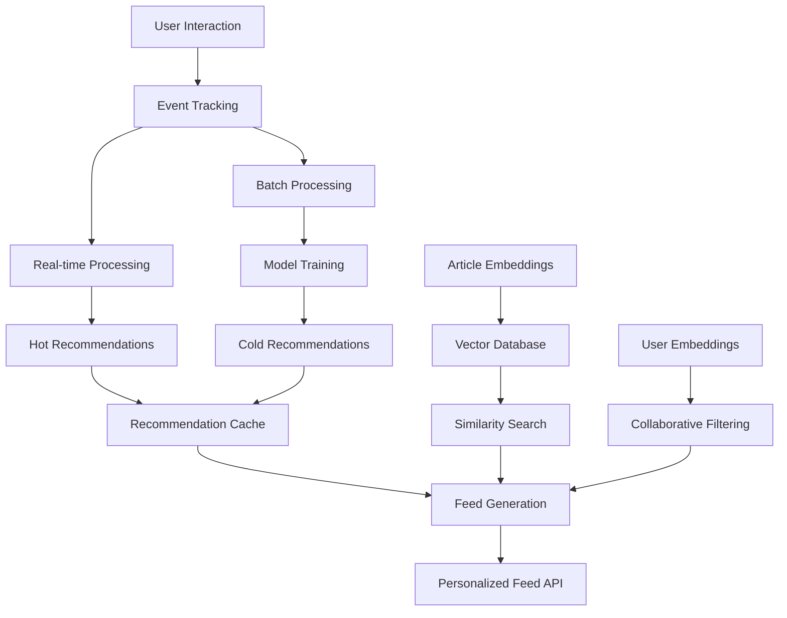
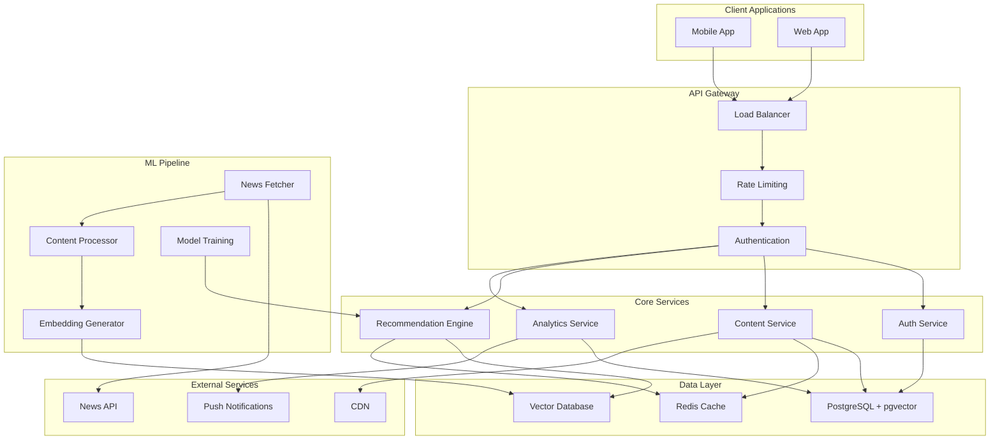
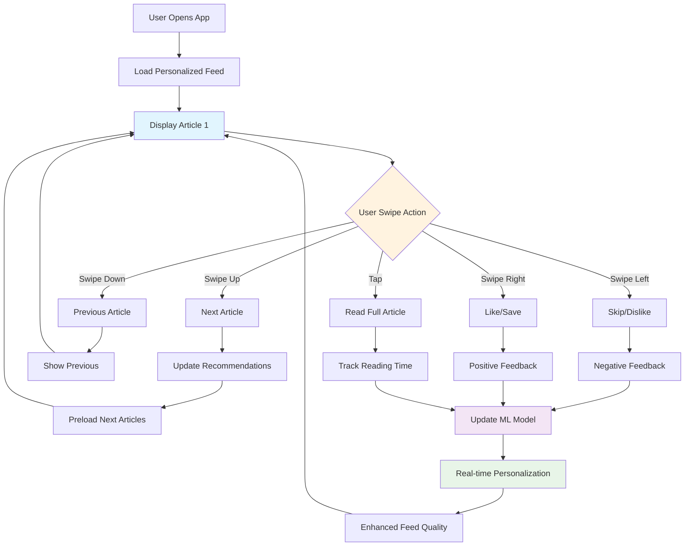
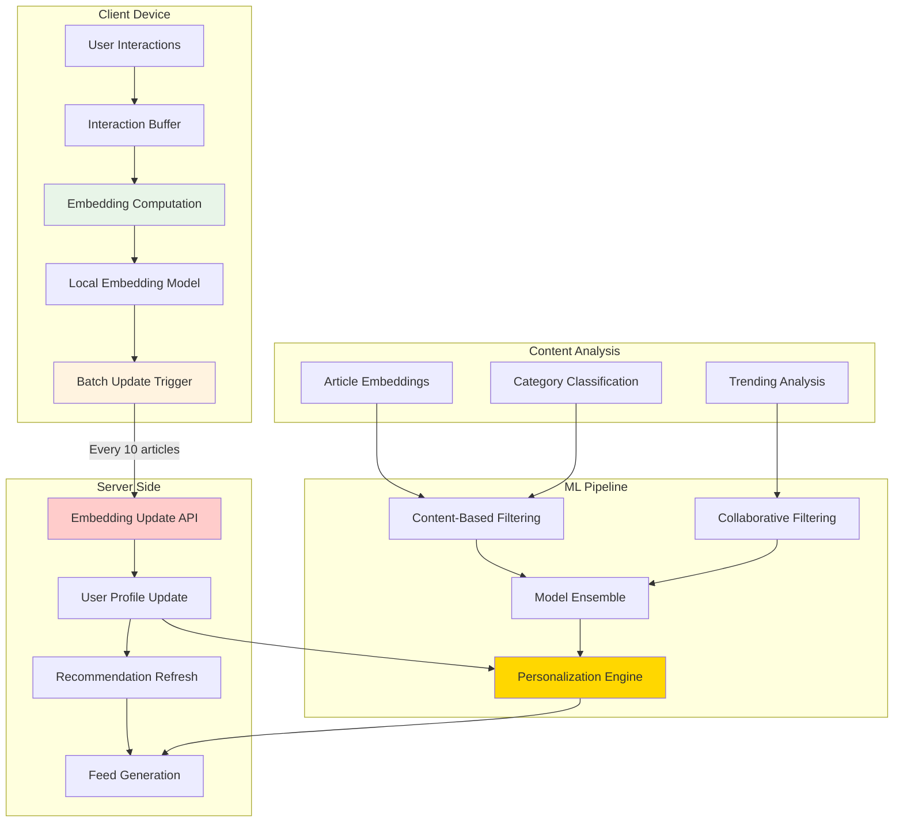
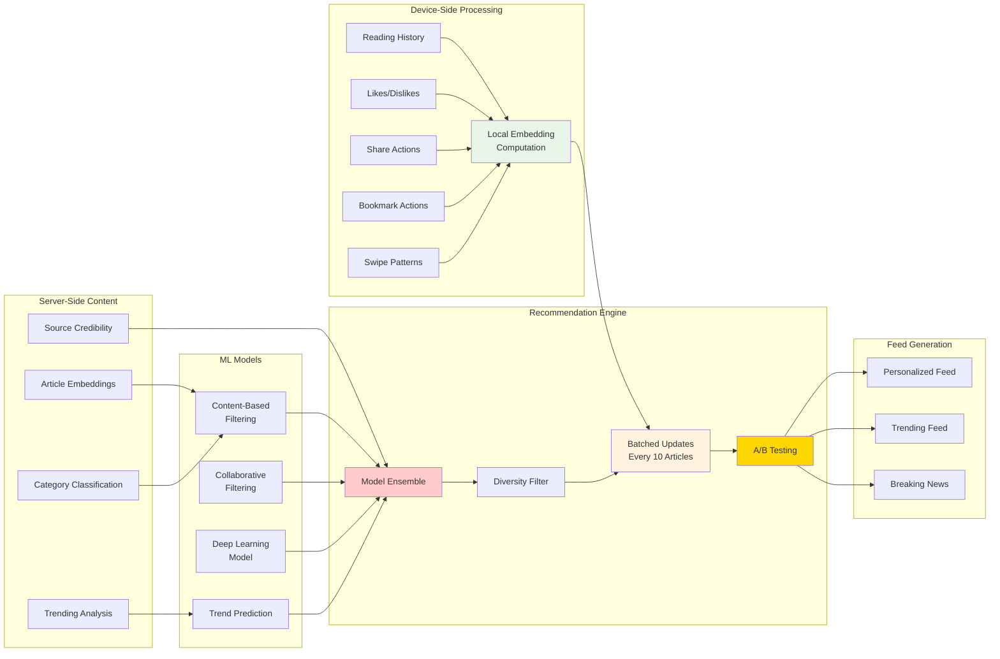

# News Recommender Backend API Documentation

## Overview

This documentation covers the complete API specification for a swipe-based news application with ML-powered recommendations and content moderation. The backend uses FastAPI, PostgreSQL with pgvector for semantic search, and a custom recommendation engine based on sentence embeddings.

## Table of Contents

1. [Authentication & User Management APIs](#1-authentication--user-management-apis)
2. [Content Management APIs](#2-content-management-apis)
3. [Discovery & Recommendation APIs](#3-discovery--recommendation-apis)
4. [Analytics & ML APIs](#4-analytics--ml-apis)
5. [Admin & Moderation APIs](#5-admin--moderation-apis)
6. [Data Models](#6-data-models)
7. [Architecture Overview](#7-architecture-overview)

---

## 1. Authentication & User Management APIs

### User Registration & Authentication

#### `POST /auth/register`
**Purpose**: Register a new user account
**Authentication**: None required

**Request Body**:
```json
{
  "email": "user@example.com",
  "password": "securepassword123",
  "username": "johndoe",
  "display_name": "John Doe",
  "preferences": {
    "categories": ["technology", "business", "politics"],
    "language": "en",
    "content_type": "mixed"
  }
}
```

**Response** (201):
```json
{
  "user_id": "uuid",
  "email": "user@example.com",
  "username": "johndoe",
  "access_token": "jwt_token",
  "refresh_token": "refresh_token",
  "expires_in": 3600
}
```

**Business Logic**: Creates user account, generates initial preference embedding, sends welcome email, creates default feed settings.

#### `POST /auth/login`
**Purpose**: Authenticate user and return access tokens
**Authentication**: None required

**Request Body**:
```json
{
  "email": "user@example.com",
  "password": "securepassword123"
}
```

**Response** (200):
```json
{
  "user_id": "uuid",
  "access_token": "jwt_token",
  "refresh_token": "refresh_token",
  "expires_in": 3600,
  "user_profile": {
    "username": "johndoe",
    "display_name": "John Doe",
    "profile_image": "url"
  }
}
```

#### `POST /auth/refresh`
**Purpose**: Refresh access token using refresh token
**Authentication**: Refresh token required

**Request Body**:
```json
{
  "refresh_token": "refresh_token"
}
```

**Response** (200):
```json
{
  "access_token": "new_jwt_token",
  "expires_in": 3600
}
```

#### `POST /auth/google`
**Purpose**: Authenticate user with Google OAuth
**Authentication**: None required

**Request Body**:
```json
{
  "id_token": "google_id_token_from_client"
}
```

**Response** (200):
```json
{
  "user_id": "uuid",
  "access_token": "jwt_token",
  "refresh_token": "refresh_token",
  "expires_in": 3600,
  "user_profile": {
    "username": "google_user_123",
    "display_name": "John Doe",
    "profile_image": "https://lh3.googleusercontent.com/..."
  }
}
```

**Business Logic**: Verifies Google ID token, creates new user if doesn't exist, returns JWT tokens.

#### `POST /auth/apple`
**Purpose**: Authenticate user with Apple OAuth
**Authentication**: None required

**Request Body**:
```json
{
  "id_token": "apple_id_token_from_client"
}
```

**Response** (200):
```json
{
  "user_id": "uuid",
  "access_token": "jwt_token",
  "refresh_token": "refresh_token",
  "expires_in": 3600,
  "user_profile": {
    "username": "apple_user_123",
    "display_name": "John Doe",
    "profile_image": null
  }
}
```

**Business Logic**: Verifies Apple ID token, creates new user if doesn't exist, returns JWT tokens.

### User Profile Management

#### `GET /users/profile`
**Purpose**: Get current user's profile information
**Authentication**: Bearer token required

**Response** (200):
```json
{
  "user_id": "uuid",
  "username": "johndoe",
  "display_name": "John Doe",
  "email": "user@example.com",
  "profile_image": "url",
  "bio": "News enthusiast and tech lover",
  "location": "San Francisco, CA",
  "created_at": "2024-01-01T00:00:00Z",
  "articles_read": 1250,
  "preferences": {
    "categories": ["technology", "business"],
    "language": "en",
    "notification_settings": {
      "push_enabled": true,
      "email_digest": true,
      "breaking_news": true
    }
  }
}
```

#### `PUT /users/profile`
**Purpose**: Update user profile information
**Authentication**: Bearer token required

**Request Body**:
```json
{
  "display_name": "John Smith",
  "bio": "Updated bio",
  "profile_image": "new_image_url",
  "preferences": {
    "categories": ["technology", "science", "health"],
    "notification_settings": {
      "push_enabled": false
    }
  }
}
```

**Response** (200): Updated profile object

---

## 2. Content Management APIs

### Article Management

#### `GET /articles`
**Purpose**: Get paginated list of articles with filtering
**Authentication**: Bearer token required

**Query Parameters**:
- `page`: int (default: 1)
- `limit`: int (default: 20, max: 100)
- `category`: string (optional)
- `source`: string (optional)
- `language`: string (default: "en")
- `sort`: enum ["recent", "trending", "relevance"] (default: "recent")
- `after_timestamp`: ISO datetime (for cursor-based pagination)

**Response** (200):
```json
{
  "articles": [
    {
      "id": "uuid",
      "title": "Breaking: Major Tech Announcement",
      "summary": "AI-generated summary of the article",
      "content_preview": "First 200 characters...",
      "url": "https://source.com/article",
      "image_url": "https://source.com/image.jpg",
      "source": {
        "id": "techcrunch",
        "name": "TechCrunch",
        "logo": "url"
      },
      "author": "Jane Smith",
      "published_at": "2024-01-20T14:30:00Z",
      "category": "technology",
      "language": "en",
      "read_time_minutes": 3,
      "engagement": {
        "views": 15420,
        "likes": 234,
        "shares": 45,
        "user_liked": false,
        "user_bookmarked": true
      },
      "relevance_score": 0.89
    }
  ],
  "total": 5000,
  "page": 1,
  "has_more": true,
  "next_cursor": "timestamp_cursor"
}
```

#### `GET /articles/{article_id}`
**Purpose**: Get full article details
**Authentication**: Bearer token required

**Response** (200):
```json
{
  "id": "uuid",
  "title": "Full Article Title",
  "summary": "AI-generated summary",
  "content": "Full article content...",
  "url": "https://source.com/article",
  "image_url": "https://source.com/image.jpg",
  "source": {
    "id": "techcrunch",
    "name": "TechCrunch",
    "logo": "url",
    "credibility_score": 0.85
  },
  "author": "Jane Smith",
  "published_at": "2024-01-20T14:30:00Z",
  "fetched_at": "2024-01-20T15:00:00Z",
  "category": "technology",
  "language": "en",
  "tags": ["AI", "machine learning", "tech industry"],
  "read_time_minutes": 3,
  "engagement": {
    "views": 15420,
    "likes": 234,
    "shares": 45,
    "user_liked": false,
    "user_bookmarked": true
  },
  "related_articles": [
    {
      "id": "uuid",
      "title": "Related Article",
      "similarity_score": 0.78
    }
  ]
}
```

**Business Logic**: Increments view count, updates user reading history for recommendations, tracks reading time.

#### `POST /articles/{article_id}/view`
**Purpose**: Track that user viewed an article (for swipe-based tracking)
**Authentication**: Bearer token required

**Request Body**:
```json
{
  "view_duration_seconds": 5.2,
  "percentage_read": 80,
  "interaction_type": "swipe_up",
  "swipe_direction": "up"
}
```

**Response** (200):
```json
{
  "tracked": true,
  "updated_recommendations": true
}
```

**Business Logic**: Updates ML model with user engagement data, triggers real-time recommendation updates if significant interaction.


---

## 3. Discovery & Recommendation APIs

### Personalized Feed

#### `GET /feed/personalized`
**Purpose**: Get personalized article feed optimized for swipe navigation
**Authentication**: Bearer token required

**Query Parameters**:
- `limit`: int (default: 50, max: 100)
- `refresh`: boolean (default: false) - force refresh recommendations
- `content_type`: enum ["articles", "videos", "mixed"] (default: "mixed")
- `diversify`: boolean (default: true) - ensure topic diversity

**Response** (200):
```json
{
  "articles": [
    {
      "id": "uuid",
      "title": "Personalized Article",
      "summary": "Summary optimized for quick reading",
      "image_url": "url",
      "source": {...},
      "recommendation_reason": "Based on your interest in AI and similar articles you liked",
      "confidence_score": 0.92,
      "position_score": 0.85,
      "content_type": "article",
      "estimated_read_time": "2 min",
      "engagement_prediction": {
        "likely_to_like": 0.78,
        "likely_to_share": 0.23,
        "likely_to_read_full": 0.65
      }
    }
  ],
  "feed_metadata": {
    "generated_at": "2024-01-20T15:00:00Z",
    "algorithm_version": "v2.1",
    "personalization_strength": 0.8,
    "diversity_score": 0.7,
    "cache_ttl_minutes": 30
  },
  "preload_next_batch": true
}
```

**Business Logic**: Uses collaborative filtering + content-based recommendations, applies diversity constraints, optimizes for swipe engagement patterns.

#### `GET /feed/trending`
**Purpose**: Get trending articles across the platform
**Authentication**: Bearer token required

**Query Parameters**:
- `timeframe`: enum ["1h", "6h", "24h", "7d"] (default: "24h")
- `category`: string (optional)
- `location`: string (optional) - for geo-trending

**Response** (200):
```json
{
  "articles": [
    {
      "id": "uuid",
      "title": "Trending Article",
      "trend_score": 0.95,
      "trending_rank": 1,
      "velocity": "fast_rising",
      "engagement_metrics": {
        "views_last_hour": 5000,
        "shares_per_minute": 12.5
      }
    }
  ],
  "trending_topics": [
    {
      "topic": "artificial intelligence",
      "mention_count": 156,
      "sentiment": "positive",
      "trending_articles_count": 23
    }
  ]
}
```

### Search & Discovery

#### `GET /search/articles`
**Purpose**: Search articles using semantic and keyword search
**Authentication**: Bearer token required

**Query Parameters**:
- `q`: string (required) - search query
- `semantic`: boolean (default: true) - use semantic search
- `category`: string (optional)
- `date_range`: enum ["24h", "7d", "30d", "all"] (default: "all")
- `sort`: enum ["relevance", "recent", "popular"] (default: "relevance")
- `limit`: int (default: 20, max: 100)

**Response** (200):
```json
{
  "articles": [
    {
      "id": "uuid",
      "title": "Search Result Article",
      "summary": "Relevant summary with highlighted terms",
      "relevance_score": 0.94,
      "match_type": "semantic",
      "highlighted_text": "...artificial <mark>intelligence</mark> breakthrough..."
    }
  ],
  "search_metadata": {
    "query": "AI breakthrough",
    "total_results": 1250,
    "search_time_ms": 45,
    "semantic_expansion": ["machine learning", "neural networks"],
    "suggested_filters": ["technology", "science"]
  }
}
```

#### `GET /articles/{article_id}/similar`
**Purpose**: Get articles similar to a specific article using vector similarity
**Authentication**: Bearer token required

**Query Parameters**:
- `limit`: int (default: 10, max: 50)
- `threshold`: float (default: 0.7) - similarity threshold

**Response** (200):
```json
{
  "similar_articles": [
    {
      "id": "uuid",
      "title": "Similar Article",
      "similarity_score": 0.87,
      "similarity_type": "semantic",
      "common_themes": ["AI", "technology", "innovation"]
    }
  ],
  "computation_method": "cosine_similarity",
  "embedding_model": "all-MiniLM-L6-v2"
}
```

### Engagement Actions

#### `POST /articles/{article_id}/like`
**Purpose**: Like an article
**Authentication**: Bearer token required

**Response** (200):
```json
{
  "liked": true,
  "total_likes": 235,
  "user_engagement_updated": true
}
```

**Business Logic**: Updates user preference learning, triggers recommendation model updates, sends notification to content creator.

#### `DELETE /articles/{article_id}/like`
**Purpose**: Unlike an article
**Authentication**: Bearer token required

**Response** (200):
```json
{
  "liked": false,
  "total_likes": 233
}
```

#### `POST /articles/{article_id}/share`
**Purpose**: Share an article
**Authentication**: Bearer token required

**Request Body**:
```json
{
  "platform": "twitter",
  "message": "Check out this interesting article!",
  "include_summary": true
}
```

**Response** (200):
```json
{
  "shared": true,
  "share_url": "https://app.com/shared/article_id",
  "total_shares": 46,
  "share_id": "uuid"
}
```

#### `POST /articles/{article_id}/bookmark`
**Purpose**: Bookmark an article for later reading
**Authentication**: Bearer token required

**Response** (200):
```json
{
  "bookmarked": true,
  "bookmark_id": "uuid",
  "reading_list_count": 23
}
```

#### `GET /users/bookmarks`
**Purpose**: Get user's bookmarked articles
**Authentication**: Bearer token required

**Query Parameters**:
- `page`: int (default: 1)
- `limit`: int (default: 20, max: 100)
- `category`: string (optional)

**Response** (200):
```json
{
  "bookmarks": [
    {
      "bookmark_id": "uuid",
      "article": {
        "id": "uuid",
        "title": "Bookmarked Article",
        "summary": "Article summary",
        "image_url": "url",
        "source": {...},
        "bookmarked_at": "2024-01-20T16:00:00Z"
      }
    }
  ],
  "total": 23,
  "page": 1,
  "has_more": false
}
```

---

## 4. Analytics & ML APIs

### User Embedding Updates

#### `POST /users/embedding/update`
**Purpose**: Update user embedding vector based on local device computation (sent every ~10 articles)
**Authentication**: Bearer token required

**Request Body**:
```json
{
  "embedding_vector": [0.1, -0.2, 0.3, ...],  // 384-dimensional vector
  "interaction_summary": {
    "articles_processed": 10,
    "session_start": "2024-01-20T16:00:00Z",
    "session_end": "2024-01-20T16:30:00Z",
    "avg_read_time_seconds": 45.2,
    "engagement_metrics": {
      "liked_articles": 3,
      "shared_articles": 1,
      "bookmarked_articles": 2,
      "skipped_articles": 4
    },
    "category_exposure": {
      "technology": 4,
      "business": 3,
      "politics": 2,
      "science": 1
    },
    "device_type": "mobile",
    "app_version": "1.2.3"
  }
}
```

**Response** (200):
```json
{
  "embedding_updated": true,
  "recommendations_refreshed": true,
  "next_batch_ready": true,
  "personalization_score": 0.87,
  "diversity_adjustment": 0.15
}
```

**Business Logic**: Updates server-side user embedding vector, triggers recommendation refresh, adjusts personalization parameters based on engagement patterns.

#### `GET /users/embedding/status`
**Purpose**: Get current user embedding status and sync requirements
**Authentication**: Bearer token required

**Response** (200):
```json
{
  "last_updated": "2024-01-20T16:00:00Z",
  "articles_since_update": 7,
  "sync_required": false,
  "embedding_version": "v2.1",
  "local_computation_config": {
    "model_name": "all-MiniLM-L6-v2",
    "update_frequency": 10,
    "batch_size_recommended": 50
  }
}
```

### Content Performance

#### `GET /articles/{article_id}/analytics`
**Purpose**: Get detailed analytics for an article
**Authentication**: Bearer token required (content creator or admin)

**Response** (200):
```json
{
  "article_id": "uuid",
  "performance_metrics": {
    "total_views": 15420,
    "unique_views": 12340,
    "average_read_time_seconds": 45.6,
    "completion_rate": 0.68,
    "engagement_rate": 0.15,
    "swipe_patterns": {
      "up": 0.45,
      "down": 0.30,
      "left": 0.15,
      "right": 0.10
    }
  },
  "demographics": {
    "age_groups": {
      "18-24": 0.25,
      "25-34": 0.40,
      "35-44": 0.20,
      "45+": 0.15
    },
    "top_locations": ["US", "UK", "CA"]
  },
  "trending_score": 0.78,
  "virality_coefficient": 1.2
}
```

### Recommendation Model Status

#### `GET /ml/model-status`
**Purpose**: Get current status of ML recommendation models
**Authentication**: Bearer token required (admin)

**Response** (200):
```json
{
  "models": {
    "content_based": {
      "version": "v2.1.5",
      "last_trained": "2024-01-20T08:00:00Z",
      "performance_score": 0.89,
      "status": "active"
    },
    "collaborative_filtering": {
      "version": "v1.8.2",
      "last_trained": "2024-01-20T06:00:00Z",
      "performance_score": 0.76,
      "status": "active"
    },
    "embedding_model": {
      "name": "all-MiniLM-L6-v2",
      "dimension": 384,
      "status": "active"
    }
  },
  "system_health": {
    "recommendation_latency_ms": 45,
    "cache_hit_rate": 0.92,
    "daily_retraining": true
  }
}
```

---

## 5. Admin & Moderation APIs

### Content Moderation

#### `GET /admin/moderation/queue`
**Purpose**: Get content pending moderation review
**Authentication**: Bearer token required (moderator role)

**Query Parameters**:
- `content_type`: enum ["articles", "users"] (default: "articles")
- `priority`: enum ["high", "medium", "low", "all"] (default: "all")
- `limit`: int (default: 20)

**Response** (200):
```json
{
  "items": [
    {
      "id": "uuid",
      "content_type": "article",
      "title": "Article Title",
      "created_at": "2024-01-20T16:00:00Z",
      "flags": [
        {
          "type": "inappropriate_content",
          "confidence": 0.85,
          "auto_flagged": true
        }
      ],
      "priority": "high",
      "estimated_review_time": "5 minutes"
    }
  ],
  "queue_stats": {
    "total_pending": 45,
    "high_priority": 8,
    "average_wait_time_hours": 2.3
  }
}
```

#### `POST /admin/moderation/{item_id}/review`
**Purpose**: Review and moderate flagged content
**Authentication**: Bearer token required (moderator role)

**Request Body**:
```json
{
  "action": "approve",
  "reason": "Content meets community guidelines",
  "notes": "Minor edits suggested but not required",
  "reviewer_confidence": "high"
}
```

**Response** (200):
```json
{
  "review_id": "uuid",
  "action_taken": "approve",
  "item_status": "published",
  "next_item_id": "uuid"
}
```

### User Management

#### `GET /admin/users`
**Purpose**: Get paginated list of users with admin controls
**Authentication**: Bearer token required (admin role)

**Query Parameters**:
- `status`: enum ["active", "suspended", "banned", "all"] (default: "all")
- `sort`: enum ["recent", "name", "engagement"] (default: "recent")
- `search`: string (optional)

**Response** (200):
```json
{
  "users": [
    {
      "user_id": "uuid",
      "username": "johndoe",
      "email": "user@example.com",
      "status": "active",
      "created_at": "2024-01-01T00:00:00Z",
      "last_active": "2024-01-20T15:30:00Z",
      "total_articles_read": 1250,
      "violations_count": 0,
      "engagement_score": 0.78
    }
  ]
}
```

#### `POST /admin/users/{user_id}/moderate`
**Purpose**: Take moderation action on a user
**Authentication**: Bearer token required (admin role)

**Request Body**:
```json
{
  "action": "suspend",
  "duration_days": 7,
  "reason": "Spam posting",
  "notify_user": true
}
```

### System Analytics

#### `GET /admin/analytics/dashboard`
**Purpose**: Get high-level system metrics and KPIs
**Authentication**: Bearer token required (admin role)

**Response** (200):
```json
{
  "user_metrics": {
    "total_users": 50000,
    "daily_active_users": 12000,
    "weekly_retention": 0.65,
    "monthly_churn": 0.08
  },
  "content_metrics": {
    "total_articles": 250000,
    "articles_today": 1200,
    "average_engagement_rate": 0.15,
    "top_categories": ["technology", "business", "politics"]
  },
  "system_health": {
    "api_response_time_ms": 120,
    "database_query_time_ms": 25,
    "recommendation_accuracy": 0.78,
    "uptime_percentage": 99.9
  }
}
```

---

## 6. Data Models

### Core Models

#### User Model
```python
class User:
    id: UUID
    username: str
    email: str
    display_name: str
    profile_image: Optional[str]
    bio: Optional[str]
    location: Optional[str]
    created_at: datetime
    last_active: datetime
    email_verified: bool
    status: UserStatus  # active, suspended, banned
    role: UserRole  # user, creator, moderator, admin
    preferences: UserPreferences
    embedding: List[float]  # User interest embedding
    articles_read: int
    engagement_score: float
```

#### Article Model
```python
class Article:
    id: UUID
    source_id: Optional[str]
    source_name: str
    author: Optional[str]
    title: str
    description: Optional[str]
    content: str
    summary: str  # AI-generated
    url: str
    url_to_image: Optional[str]
    published_at: datetime
    fetched_at: datetime
    language: str
    category: str
    tags: List[str]
    embedding: List[float]  # 384-dimensional semantic embedding
    
    # Engagement metrics
    views: int
    likes: int
    shares: int
    bookmarks: int
    read_time_avg_seconds: float
    completion_rate: float
    
    # Content metadata
    read_time_minutes: int
    difficulty_level: str
    content_type: ContentType  # article, video, podcast
    moderation_status: ModerationStatus
    trending_score: float
```

#### User Embedding Update Model
```python
class UserEmbeddingUpdate:
    id: UUID
    user_id: UUID
    embedding_vector: List[float]  # 384-dimensional vector
    interaction_summary: InteractionSummary
    session_start: datetime
    session_end: datetime
    articles_processed: int
    device_type: str
    app_version: str
    created_at: datetime

class InteractionSummary:
    avg_read_time_seconds: float
    engagement_metrics: EngagementMetrics
    category_exposure: Dict[str, int]  # category -> count
    
class EngagementMetrics:
    liked_articles: int
    shared_articles: int
    bookmarked_articles: int
    skipped_articles: int
```

#### Bookmark Model
```python
class Bookmark:
    id: UUID
    user_id: UUID
    article_id: UUID
    created_at: datetime
    notes: Optional[str]
```

---

## 7. Architecture Overview

### Recommendation System Architecture



### Swipe-Based Navigation Flow

The swipe navigation system is optimized for smooth, continuous content consumption:

1. **Swipe Up**: Next article in personalized feed
2. **Swipe Down**: Previous article (limited history)
3. **Swipe Left**: Dislike/Skip (negative feedback)
4. **Swipe Right**: Like/Save (positive feedback)

### Local Embedding Computation Architecture

This system uses **client-side ML computation** to improve privacy, reduce server load, and enable real-time personalization:

#### Benefits:
- **Privacy-First**: User behavior stays on device until aggregated
- **Reduced Latency**: No need to send individual events to server
- **Offline Capability**: Personalization works without constant connectivity
- **Scalability**: Server load reduced by ~90% compared to real-time tracking
- **Battery Efficient**: Batched updates use less network/battery

#### How It Works:
1. **Local Processing**: Device runs lightweight embedding model (all-MiniLM-L6-v2)
2. **Interaction Buffering**: User actions stored locally for batch processing
3. **Embedding Updates**: Every 10 articles, device computes updated user embedding
4. **Batch Sync**: Aggregated embedding + summary stats sent to server
5. **Recommendation Refresh**: Server updates recommendations based on new embedding

#### Technical Implementation:
- **Model Size**: ~22MB embedding model downloaded on first use
- **Computation Time**: <100ms per batch update on modern devices
- **Memory Usage**: <50MB additional RAM for local ML processing
- **Network Efficiency**: 95% reduction in API calls vs. real-time tracking

### Caching Strategy

- **L1 Cache**: In-memory cache for hot recommendations (Redis)
- **L2 Cache**: Database query cache for article metadata
- **L3 Cache**: CDN cache for static assets (images, videos)
- **Preloading**: Next 10-20 articles preloaded for smooth swiping

### Performance Optimizations

1. **Embedding Similarity**: Precomputed using pgvector for sub-100ms queries
2. **Feed Generation**: Cached for 30 minutes, updated incrementally
3. **Image Processing**: Multiple resolutions for different devices
4. **Database Sharding**: Articles sharded by date, users by ID hash

### Security Considerations

- JWT tokens with 1-hour expiration
- Rate limiting on all endpoints
- Content sanitization for XSS prevention
- GDPR compliance for EU users
- COPPA compliance for users under 13

### Error Handling

All endpoints return consistent error responses:
```json
{
  "error": {
    "code": "VALIDATION_ERROR",
    "message": "Invalid request parameters",
    "details": {
      "field": "email",
      "reason": "Invalid email format"
    },
    "request_id": "uuid"
  }
}
```

Common HTTP status codes:
- `400`: Bad Request (validation errors)
- `401`: Unauthorized (invalid/missing token)
- `403`: Forbidden (insufficient permissions)
- `404`: Not Found
- `429`: Too Many Requests (rate limited)
- `500`: Internal Server Error

### Implementation Priority

**Phase 1 (MVP)**:
1. User authentication and basic profiles
2. Article CRUD and viewing
3. Basic recommendation engine
4. Like/bookmark functionality
5. Local embedding computation on device

**Phase 2 (Enhanced Features)**:
1. Advanced recommendation algorithms
2. Batched embedding updates
3. Search and discovery
4. Analytics dashboard

**Phase 3 (Advanced Features)**:
1. Advanced analytics
2. Admin dashboard
3. Content moderation tools
4. Performance optimizations

**Phase 4 (Optimization)**:
1. Edge computing optimizations
2. Advanced ML features
3. A/B testing framework
4. Real-time personalization refinements

This API specification provides a comprehensive foundation for building a modern, engaging news application with sophisticated recommendation capabilities and smooth swipe-based navigation.

## System Architecture

### News Recommender System Architecture



### News Recommender System - High-Level Architecture



### Local Embedding Computation Flow


### User Interaction Flow Diagram
